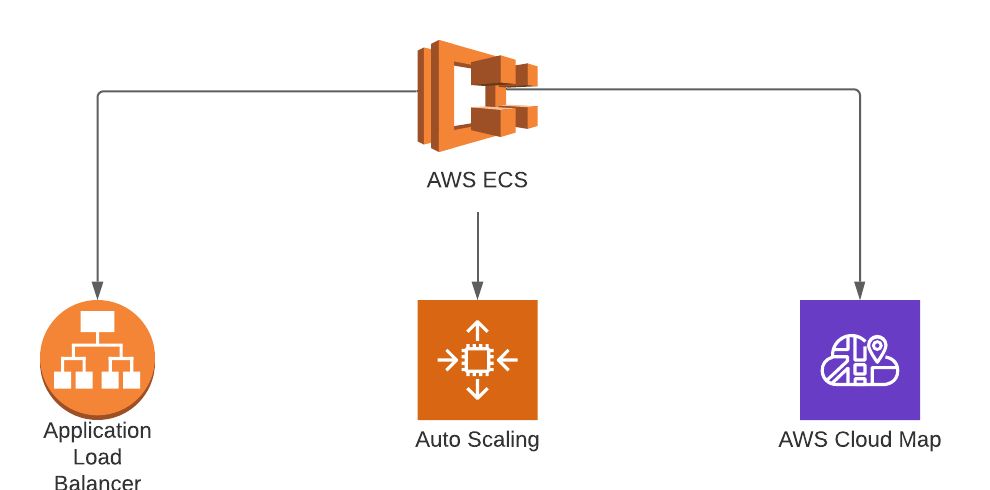

# terraform-aws-ecs-service


Terraform module -

---




**Fargate Service Module**

## Usage

```terraform
  module "key-manager-svc" {
    source          = "../ama-repos/terraform-aws-fargate-service/"
    resource_prefix = "ecs_test"
    ecs_cluster_id  = module.fargate.ecs_cluster_id
    ecs_task_definition_arn = module.key-manager-td.aws_ecs_task_definition_td_arn
    task_count = 1
    enable_autoscaling = true
    create_discovery_record = false
    ecs_security_groups = [module.ecs_test_sg.security_group_id]
    alb_subnets_private = ["subnet-0d7f3596ccf0c24fc","subnet-061bf61eefcd02632"]
    load_balancers     = [{
      target_group_arn = "arn:aws:elasticloadbalancing:us-east-1:058303991275:targetgroup/mytargetgroup/7c2fbf8b88b695ab"
      container_name   = "Splunk"
      container_port   = 80

    }]
    app_port = "9445"
    container_name = "key-manager"
    sd_record_name = "key-manager"
    #lb_arn = module.key-manager-alb.aws_lb_arn #Re-enable if provisioning order issues with ALB arise. 
    health_check_grace_period_seconds = 90
    tag_name                         = "pe-prd-key-manager-td"
    tag_environment                  = "prd"
    tag_contact                      = "Sandeep.Dhamale@ama-assn.org"
    tag_systemtier                   = "0"
    tag_drtier                       = "0"
    tag_dataclassification           = "N/A"
    tag_budgetcode                   = "PBW"
    tag_owner                        = "Erek Horne"
    tag_projectname                  = "Platform Experience"
    tag_notes                        = "N/A"
    tag_eol                          = "N/A"
    tag_maintwindow                  = "N/A"
    tags                             = {custom_tag = "example"}
}

```

## Features

### Auto Scaling Support

You can enable auto scaling support by passing in true to the auto scale variable 

```terraform
   enable_autoscaling = true
```

###  CloudMap/Service Discovery Support

You can register the service with cloudmap by passing in a service registy block (assumes the service is created outside the module

```terraform
  service_registries      = {
    registry_arn = ""
    container_name = ""
    container_port = ""
  }
```
### Load Balancing Support

You can register the service with a load balancer target group using the load_balancer block

```terraform
  load_balancers     = [{
      target_group_arn = "arn:aws:elasticloadbalancing:us-east-1:058303991275:targetgroup/mytargetgroup/7c2fbf8b88b695ab"
      container_name   = "Splunk"
      container_port   = 80

    }]

```

## Requirements

| Name | Version |
|------|---------|
| terraform | >= 0.12 |
| aws | >= 2.7 |

## Providers

| Name | Version |
|------|---------|
| aws | >= 2.7 |

## Modules

No Modules.

## Resources

| Name |
|------|
| [aws_appautoscaling_policy](https://registry.terraform.io/providers/hashicorp/aws/latest/docs/resources/appautoscaling_policy) |
| [aws_appautoscaling_target](https://registry.terraform.io/providers/hashicorp/aws/latest/docs/resources/appautoscaling_target) |
| [aws_ecs_service](https://registry.terraform.io/providers/hashicorp/aws/latest/docs/resources/ecs_service) |
| [aws_service_discovery_service](https://registry.terraform.io/providers/hashicorp/aws/latest/docs/resources/service_discovery_service) |

## Inputs

| Name | Description | Type | Default | Required |
|------|-------------|------|---------|:--------:|
| alb\_listener\_default\_redirect\_host | Host to which request will be redirected (only used if alb\_listener\_default\_action is redirect) | `string` | `"#{host}"` | no |
| alb\_subnets\_private | List of Ids of subnets in which load balancer will be hosted if alb\_internal = true. App will be hosted in private subnets. | `list(string)` | n/a | yes |
| app\_environment | The applcation environment name (used in naming) | `string` | `"dev"` | no |
| app\_name | The applcation name (used in naming) | `string` | `"app-name"` | no |
| app\_port | n/a | `string` | `443` | no |
| container\_name | The name of the load balanced container | `string` | n/a | yes |
| cpu\_statistic | Statistics to use: [Maximum, SampleCount, Sum, Minimum, Average]. Note that resolution used in alarm generated is 1 minute. | `string` | `"Average"` | no |
| cpu\_threshold | The CPU alarm threshold | `number` | `85` | no |
| create\_discovery\_record | Set to true to create a serice discovery record | `bool` | `false` | no |
| disable\_scale\_in | Indicates whether scale in by the target tracking policy is disabled. | `bool` | `false` | no |
| ecs\_cluster\_id | Only needed if enable\_monitoring = 1 | `string` | `""` | no |
| ecs\_cluster\_name | Name (not ARN) of ECS Cluster that the autoscaling group is attached to | `string` | `"change_me"` | no |
| ecs\_max\_capacity | The maximum capacity of the auto scaling group | `number` | `4` | no |
| ecs\_min\_capacity | The minimum capacity of the auto scaling group | `number` | `1` | no |
| ecs\_security\_groups | List of ecs security groups to apply to the ecs service | `list(string)` | n/a | yes |
| ecs\_task\_definition\_arn | ARN of ECS task definition to use with service | `string` | n/a | yes |
| enable\_autoscaling | set to true to use auto scaling | `bool` | `false` | no |
| health\_check\_grace\_period\_seconds | n/a | `number` | `60` | no |
| lb\_arn | n/a | `string` | `null` | no |
| load\_balancers | A list of load balancer config objects for the ECS service | <pre>list(object({<br>    container_name   = string<br>    container_port   = number<br>    target_group_arn = string<br>  }))</pre> | `[]` | no |
| namespace\_id | n/a | `string` | `null` | no |
| resource\_prefix | Naming prefix to use for resources to be provisioned | `string` | `"pe-dev"` | no |
| sd\_record\_name | The service discovery DNS name of the servivce | `string` | n/a | yes |
| service\_registries | The service discovery registries for the service. The maximum number of service\_registries blocks is 1. | <pre>list(object({<br>    registry_arn   = string<br>    container_name = string<br>    container_port = number<br>  }))</pre> | `[]` | no |
| tag\_app\_name | Application Name (eg Network Watcher) | `string` | `"testng"` | no |
| tag\_app\_owner | Application Owner (eg Joe Shmo) | `string` | `"testng"` | no |
| tag\_budgetcode | budget code | `string` | `"budget code testng"` | no |
| tag\_contact | contact | `string` | `"contact testng"` | no |
| tag\_cost\_center\_number | Cost Center number (eg 8565060) | `string` | `"testng"` | no |
| tag\_dataclassification | data classification | `string` | `"data classification testng"` | no |
| tag\_drtier | DR tier | `string` | `"DR tier testng"` | no |
| tag\_environment | environment | `string` | `"environment testng"` | no |
| tag\_eol | EOL | `string` | `"EOL tag testng"` | no |
| tag\_maintwindow | maintenance window | `string` | `"maint window tag testng"` | no |
| tag\_name | Application Name | `string` | `"name testng"` | no |
| tag\_notes | notes | `string` | `"notes testng"` | no |
| tag\_owner | owner | `string` | `"owner testng"` | no |
| tag\_projectname | project name | `string` | `"project name testng"` | no |
| tag\_subcost\_center | Sub Cost Center (eg EFT Team) | `string` | `"testng"` | no |
| tag\_systemtier | system tier | `string` | `"system tier testng"` | no |
| tags | Tags assigned to all capable resources. | `map(string)` | `{}` | no |
| target\_group\_arn | ecs load balancer config targget group arn | `string` | `null` | no |
| task\_count | n/a | `string` | `1` | no |

## Outputs


## Help

**Got a question?**

File a Ticket with IT

## Contributing

### Bug Reports & Feature Requests

## Copyrights

Copyright © 2021 Vitorrio Brooks

## License

### Contributors

List of contributors

