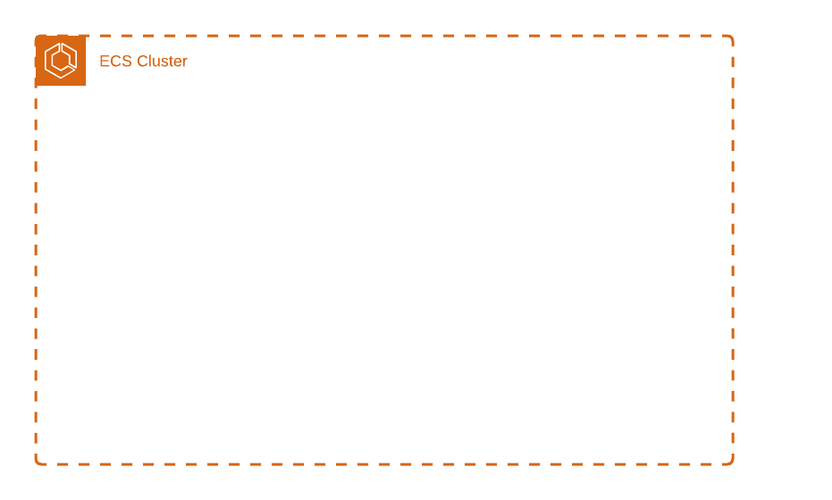

# terraform-aws-efs


Terraform module -

---




**EFS  Module**

## Usage

```terraform
  module efs-cluster {
  source = "../ama-repos/terraform-aws-efs/"
  performance_mode = "generalPurpose"
  transition_to_ia = "AFTER_14_DAYS"
  posix_user_gid   = 999
  posix_user_uid   = 999
  path_permissions = 777
  app_name                         = "cpt-api"
  app_environment                  = "dev"
  subnet_ids                       = ["subnet-a4a42efb","subnet-918ad3dc"]
  security_groups                  = ["sg-78d3c44e"]
  tag_name                         = "cpt-api-dev-efs-file-system"
  tag_environment                  = "dev"
  tag_contact                      = "Sandeep.Dhamale@ama-assn.org"
  tag_systemtier                   = "0"
  tag_drtier                       = "0"
  tag_dataclassification           = "N/A"
  tag_budgetcode                   = "PBW"
  tag_owner                        = "Erek Horne"
  tag_projectname                  = "Platform Experience"
  tag_notes                        = "N/A"
  tag_eol                          = "N/A"
  tag_maintwindow                  = "N/A"
  environment                      = "prd"
}

```

## Features

### Settings Block Support

Most cofigurable settings blocks have been defined as dynamic blocks. Therefore, you can create these resources by passing a configuration for them in your top-level stack. 
For example, task definitions that need to mount EFS volumes can do so by defining a volume block, as shown below

```terraform
   volume = [
    {
      name = "conf",
      efs_volume_configuration = [
        {
          "file_system_id" : module.efs-cluster.writeable_filesystem_id,
          "transit_encryption" : "ENABLED",
          "authorization_config" : {
            "access_point_id" :  module.efs-cluster.conf_access_point_id,
            "iam"             : "ENABLED"
          }
        }
      ]
    },
    
    {
      name = "security", 
      efs_volume_configuration = [
        {
          "file_system_id" : module.efs-cluster.writeable_filesystem_id,
          "transit_encryption" : "ENABLED",
          "authorization_config" : {
            "access_point_id" :  module.efs-cluster.security_access_point_id,
            "iam"             : "ENABLED"
          }
        }
      ]
    }

  ]
```

###  IAM Role Support 

As the task execution role must be created before the task can be deployed, IAM roles are accessed by name

```terraform
  execution_role_name = "ecs_test_role"
  task_role_name = "ecs_test_role" 
```
### Defining Containers

Container defintions are loaded from external JSON files defined in a directory named *task-definitions* within the top-level stack (app stack) root module. The module locates the
proper JSON file by appendng .json to the name passed to the *task_name* variable and then searchnng for that file in the *task-definitions* folder. 

```terraform
  task_name       = "my-td"
```

## Requirements

| Name | Version |
|------|---------|
| terraform | >= 0.12 |

## Providers

| Name | Version |
|------|---------|
| aws | n/a |

## Modules

No Modules.

## Resources

| Name |
|------|
| [aws_caller_identity](https://registry.terraform.io/providers/hashicorp/aws/latest/docs/data-sources/caller_identity) |
| [aws_ecs_task_definition](https://registry.terraform.io/providers/hashicorp/aws/latest/docs/resources/ecs_task_definition) |

## Inputs

| Name | Description | Type | Default | Required |
|------|-------------|------|---------|:--------:|
| command | (Optional) The command that is passed to the container | `list(string)` | `null` | no |
| conf\_access\_point\_id | n/a | `string` | `""` | no |
| conf\_file\_system\_id | n/a | `string` | `""` | no |
| container\_cpu | (Optional) The number of cpu units to reserve for the container. This is optional for tasks using Fargate launch type and the total amount of container\_cpu of all containers in a task will need to be lower than the task-level cpu value | `number` | `2048` | no |
| container\_depends\_on | (Optional) The dependencies defined for container startup and shutdown. A container can contain multiple dependencies. When a dependency is defined for container startup, for container shutdown it is reversed | <pre>list(object({<br>    containerName = string<br>    condition     = string<br>  }))</pre> | `null` | no |
| container\_memory | (Optional) The amount of memory (in MiB) to allow the container to use. This is a hard limit, if the container attempts to exceed the container\_memory, the container is killed. This field is optional for Fargate launch type and the total amount of container\_memory of all containers in a task will need to be lower than the task memory value | `number` | `4096` | no |
| container\_memory\_reservation | (Optional) The amount of memory (in MiB) to reserve for the container. If container needs to exceed this threshold, it can do so up to the set container\_memory hard limit | `number` | `2048` | no |
| dns\_servers | (Optional) Container DNS servers. This is a list of strings specifying the IP addresses of the DNS servers | `list(string)` | `null` | no |
| docker\_labels | (Optional) The configuration options to send to the `docker_labels` | `map(string)` | `null` | no |
| entrypoint | (Optional) The entry point that is passed to the container | `list(string)` | `null` | no |
| environment | (Optional) The environment variables to pass to the container. This is a list of maps | <pre>list(object({<br>    name  = string<br>    value = string<br>  }))</pre> | `[]` | no |
| environment\_name | n/a | `string` | `"not_set"` | no |
| essential | (Optional) Determines whether all other containers in a task are stopped, if this container fails or stops for any reason. Due to how Terraform type casts booleans in json it is required to double quote this value | `bool` | `true` | no |
| execution\_role\_arn | (Optional) The ARN of IAM role that allows your Amazon ECS container task to make calls to other AWS services. If not specified, `aws_iam_role.ecs_task_execution_role.arn` is used | `string` | `null` | no |
| execution\_role\_name | (Optional) The name of the IAM role that allows your Amazon ECS container task to pull images from ECR. If not specified, `aws_iam_role.ecs_task_execution_role.arn` is used | `string` | `null` | no |
| firelens\_configuration | (Optional) The FireLens configuration for the container. This is used to specify and configure a log router for container logs. For more details, see https://docs.aws.amazon.com/AmazonECS/latest/APIReference/API_FirelensConfiguration.html | <pre>object({<br>    type    = string<br>    options = map(string)<br>  })</pre> | `null` | no |
| healthcheck | (Optional) A map containing command (string), timeout, interval (duration in seconds), retries (1-10, number of times to retry before marking container unhealthy), and startPeriod (0-300, optional grace period to wait, in seconds, before failed healthchecks count toward retries) | <pre>object({<br>    command     = list(string)<br>    retries     = number<br>    timeout     = number<br>    interval    = number<br>    startPeriod = number<br>  })</pre> | `null` | no |
| links | (Optional) List of container names this container can communicate with without port mappings | `list(string)` | `null` | no |
| linux\_parameters | Linux-specific modifications that are applied to the container, such as Linux kernel capabilities. For more details, see https://docs.aws.amazon.com/AmazonECS/latest/APIReference/API_LinuxParameters.html | <pre>object({<br>    capabilities = object({<br>      add  = list(string)<br>      drop = list(string)<br>    })<br>    devices = list(object({<br>      containerPath = string<br>      hostPath      = string<br>      permissions   = list(string)<br>    }))<br>    initProcessEnabled = bool<br>    maxSwap            = number<br>    sharedMemorySize   = number<br>    swappiness         = number<br>    tmpfs = list(object({<br>      containerPath = string<br>      mountOptions  = list(string)<br>      size          = number<br>    }))<br>  })</pre> | `null` | no |
| log\_configuration | (Optional) Log configuration options to send to a custom log driver for the container. For more details, see https://docs.aws.amazon.com/AmazonECS/latest/APIReference/API_LogConfiguration.html | <pre>object({<br>    logDriver = string<br>    options   = map(string)<br>    secretOptions = list(object({<br>      name      = string<br>      valueFrom = string<br>    }))<br>  })</pre> | `null` | no |
| mount\_points | (Optional) Container mount points. This is a list of maps, where each map should contain a `containerPath` and `sourceVolume` | <pre>list(object({<br>    containerPath = string<br>    sourceVolume  = string<br>  }))</pre> | `[]` | no |
| name\_prefix | Name prefix for resources on AWS | `any` | n/a | yes |
| placement\_constraints | (Optional) A set of placement constraints rules that are taken into consideration during task placement. Maximum number of placement\_constraints is 10. This is a list of maps, where each map should contain "type" and "expression" | `list` | `[]` | no |
| port\_mappings | The port mappings to configure for the container. This is a list of maps. Each map should contain "containerPort", "hostPort", and "protocol", where "protocol" is one of "tcp" or "udp". If using containers in a task with the awsvpc or host network mode, the hostPort can either be left blank or set to the same value as the containerPort | <pre>list(object({<br>    containerPort = number<br>    hostPort      = number<br>    protocol      = string<br>  }))</pre> | <pre>[<br>  {<br>    "containerPort": 80,<br>    "hostPort": 80,<br>    "protocol": "tcp"<br>  }<br>]</pre> | no |
| proxy\_configuration | (Optional) The proxy configuration details for the App Mesh proxy. This is a list of maps, where each map should contain "container\_name", "properties" and "type" | `list` | `[]` | no |
| readonly\_root\_filesystem | (Optional) Determines whether a container is given read-only access to its root filesystem. Due to how Terraform type casts booleans in json it is required to double quote this value | `bool` | `false` | no |
| repository\_credentials | (Optional) Container repository credentials; required when using a private repo.  This map currently supports a single key; "credentialsParameter", which should be the ARN of a Secrets Manager's secret holding the credentials | `map(string)` | `null` | no |
| secrets | (Optional) The secrets to pass to the container. This is a list of maps | <pre>list(object({<br>    name      = string<br>    valueFrom = string<br>  }))</pre> | `null` | no |
| start\_timeout | (Optional) Time duration (in seconds) to wait before giving up on resolving dependencies for a container. | `number` | `30` | no |
| stop\_timeout | (Optional) Timeout in seconds between sending SIGTERM and SIGKILL to container | `number` | `30` | no |
| system\_controls | (Optional) A list of namespaced kernel parameters to set in the container, mapping to the --sysctl option to docker run. This is a list of maps: { namespace = "", value = ""} | `list(map(string))` | `null` | no |
| tag\_budgetcode | budget code | `string` | `"budget code testng"` | no |
| tag\_contact | contact | `string` | `"contact testng"` | no |
| tag\_dataclassification | data classification | `string` | `"data classification testng"` | no |
| tag\_drtier | DR tier | `string` | `"DR tier testng"` | no |
| tag\_environment | environment | `string` | `"environment testng"` | no |
| tag\_eol | EOL | `string` | `"EOL tag testng"` | no |
| tag\_maintwindow | maintenance window | `string` | `"maint window tag testng"` | no |
| tag\_name | Application Name | `string` | `"name testng"` | no |
| tag\_notes | notes | `string` | `"notes testng"` | no |
| tag\_owner | owner | `string` | `"owner testng"` | no |
| tag\_projectname | project name | `string` | `"project name testng"` | no |
| tag\_systemtier | system tier | `string` | `"system tier testng"` | no |
| tags | Tags assigned to all capable resources. | `map(string)` | `{}` | no |
| task\_execution\_role | (Optional) The ARN of IAM role that allows your Amazon ECS container task to make calls to other AWS services. If not specified, `aws_iam_role.ecs_task_execution_role.arn` is used | `string` | `"pe-dev-task-exe-role"` | no |
| task\_name | ------------------------------------------------------------------------------ AWS ECS Container Definition Variables ------------------------------------------------------------------------------ | `string` | n/a | yes |
| task\_role\_arn | (Optional) The ARN of IAM role that allows your Amazon ECS container task to make calls to other AWS services. If not specified, `aws_iam_role.ecs_task_execution_role.arn` is used | `string` | `null` | no |
| task\_role\_name | (Optional) The name of IAM role that allows your Amazon ECS container task to make calls to other AWS services. If not specified, `aws_iam_role.ecs_task_execution_role.arn` is used | `string` | `null` | no |
| ulimits | (Optional) Container ulimit settings. This is a list of maps, where each map should contain "name", "hardLimit" and "softLimit" | <pre>list(object({<br>    name      = string<br>    hardLimit = number<br>    softLimit = number<br>  }))</pre> | `null` | no |
| user | (Optional) The user to run as inside the container. Can be any of these formats: user, user:group, uid, uid:gid, user:gid, uid:group | `string` | `null` | no |
| volume | (Optional) A set of volume blocks that containers in your task may use. This is a list of maps, where each map should contain "name", "host\_path", "docker\_volume\_configuration" and "efs\_volume\_configuration". Full set of options can be found at https://www.terraform.io/docs/providers/aws/r/ecs_task_definition.html | `list` | `[]` | no |
| volumes | (Optional) A set of volume blocks that containers in your task may use | <pre>list(object({<br>    host_path = string<br>    name      = string<br>    docker_volume_configuration = list(object({<br>      autoprovision = bool<br>      driver        = string<br>      driver_opts   = map(string)<br>      labels        = map(string)<br>      scope         = string<br>    }))<br>    efs_volume_configuration = list(object({<br>      file_system_id = string<br>      root_directory = string<br>    }))<br>  }))</pre> | `[]` | no |
| volumes\_from | (Optional) A list of VolumesFrom maps which contain "sourceContainer" (name of the container that has the volumes to mount) and "readOnly" (whether the container can write to the volume) | <pre>list(object({<br>    sourceContainer = string<br>    readOnly        = bool<br>  }))</pre> | `null` | no |
| working\_directory | (Optional) The working directory to run commands inside the container | `string` | `null` | no |

## Outputs

| Name | Description |
|------|-------------|
| aws\_ecs\_task\_definition\_td\_arn | Full ARN of the Task Definition (including both family and revision). |
| aws\_ecs\_task\_definition\_td\_family | The family of the Task Definition. |
| aws\_ecs\_task\_definition\_td\_revision | The revision of the task in a particular family. |


## Help

**Got a question?**

File a Ticket with IT

## Contributing

### Bug Reports & Feature Requests

## Copyrights

Copyright © 2021 American Medical Association

## License

### Contributors

List of contributors
